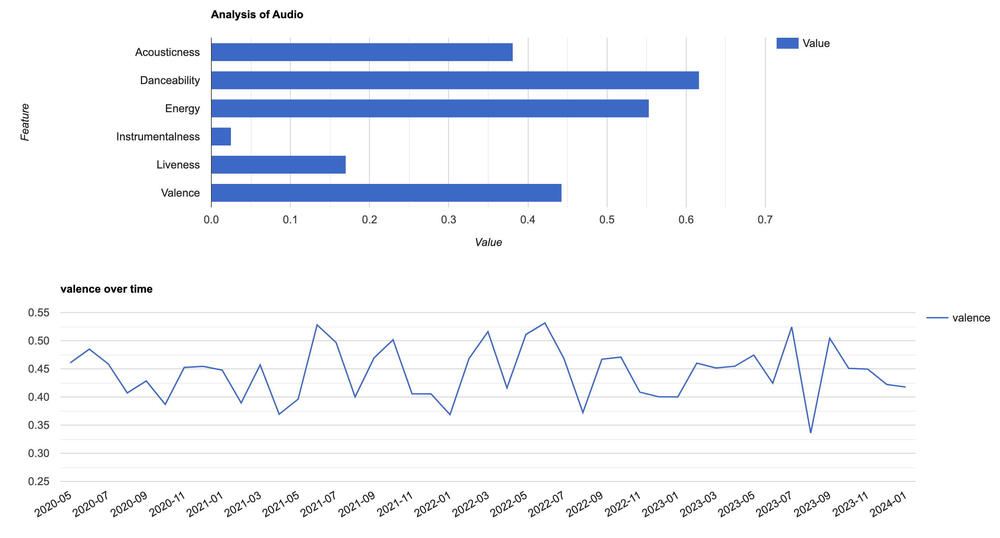
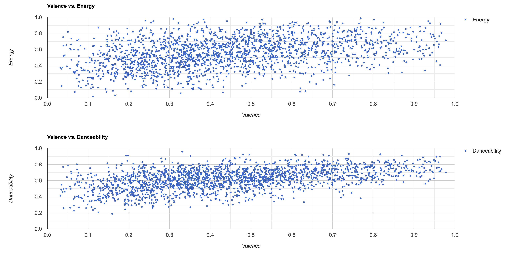
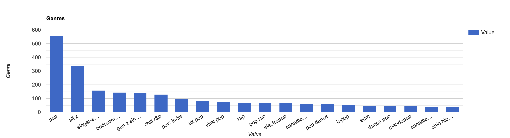

# Music Taste Analyzer

Objective: Analyze a user's music taste and provide insights and recommendations.

## Setup

1. Create a Spotify app and paste your client secret and client id keys into your .env
2. Run `npm install`
3. Run `npm run dev` to view the site

## Project Milestones

User Authentication:

- Implement Spotify API authentication for user login.
- Retrieve user's top tracks, artists, and genres.

Data Analysis:

- Use data visualization tools to display the user's music preferences.
- Analyze patterns, favorite genres, and changes over time.

## Future Followups

Recommendations:

- Utilize Spotify API endpoints for recommendations.
- Provide personalized song and artist recommendations based on the user's taste.

User Interaction:

- Allow users to explore and save recommended tracks directly to their Spotify playlists.
